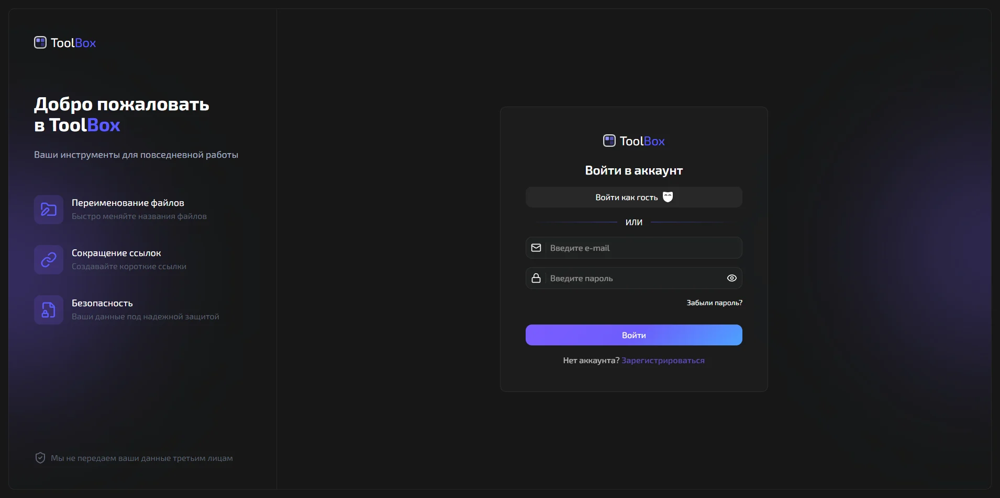
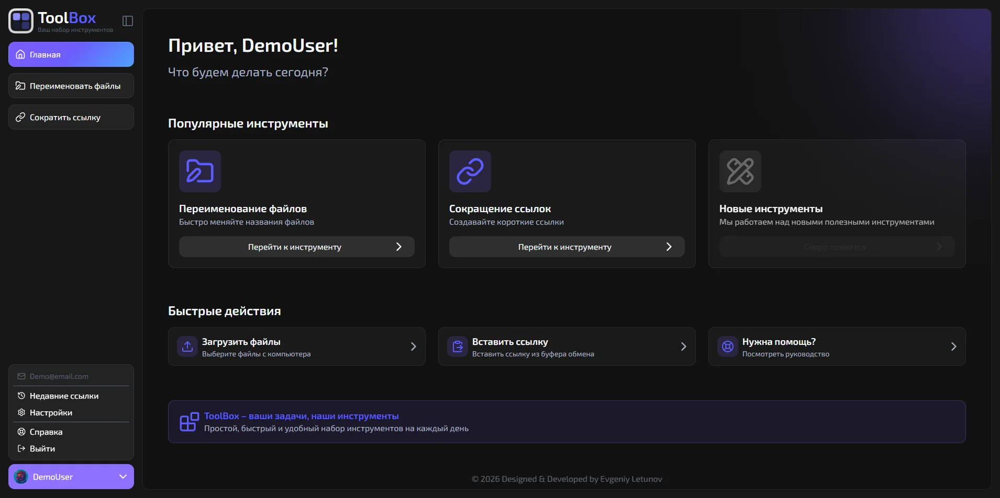
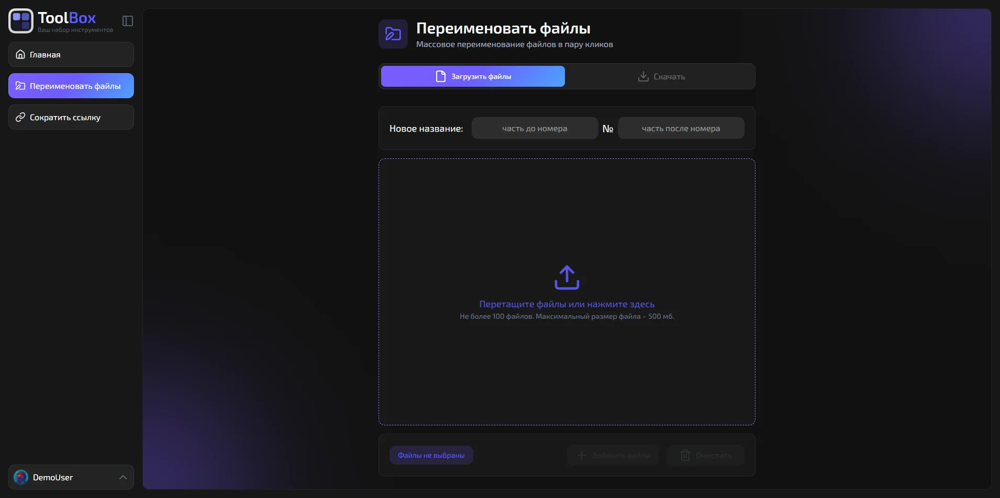
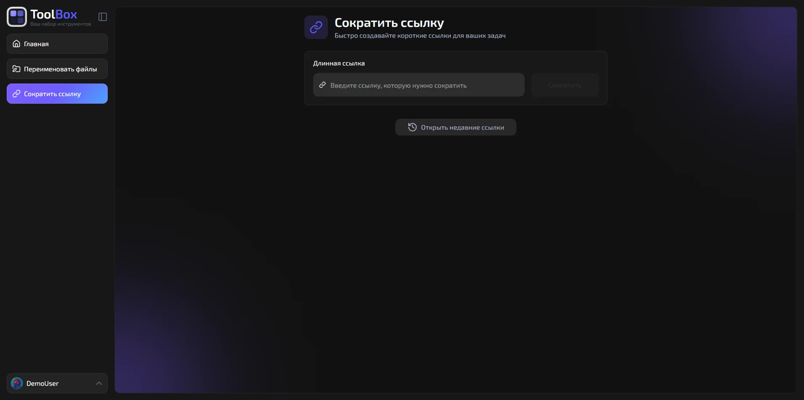

# ToolBox – платформа веб-инструментов под конкретные задачи

**ToolBox** – fullstack-платформа, объединяющая набор специализированных веб-инструментов в единой экосистеме с общей системой авторизации, пользовательским профилем и масштабируемой модульной архитектурой.

> [!IMPORTANT]
>
> Посмотреть проект в деле:
>
> 

## Технологический стек

Проект построен на современном fullstack-стеке:

### Frontend

- **React** + **TypeScript** – компонентная архитектура и строгая типизация;
- **FSD (Feature-Sliced Design)** – модульная организация кода и четкое разделение ответственности;
- **Tailwind CSS** – единый дизайн-код и быстрая адаптивная разработка;
- **MobX** – реактивное управление состоянием приложения;
- **Vite** – быстрый запуск и оптимизированная сборка.

### Backend

- **Laravel** – REST API и серверная бизнес-логика;
- **Sanctum** – безопасная cookie-based аутентификация;
- **MySQL** – хранение пользовательских данных и истории операций;
- **Resend** – работа с транзакционными письмами и подтверждением почты.

## Что внутри?

### Общая инфраструктура платформы

- cookie-based аутентификация через Laravel Sanctum;
- email verification и password reset через Resend;
- интернационализация (i18n);
- поддержка светлой и тёмной темы;
- полностью адаптивный интерфейс для desktop и mobile;
- защищённые маршруты для авторизованных пользователей;
- централизованное управление состоянием через MobX;
- масштабируемая система подключения новых инструментов.

### Пакетный переименователь файлов

**Массовое переименование файлов по заданному шаблону:**

- загрузка произвольного набора файлов через drag & drop или диалог;
- задание префикса и суффикса относительно порядкового номера через маску;
- мгновенный предпросмотр итоговых имён до скачивания;
- скачивание переименованных файлов одним ZIP-архивом.

### Сократитель ссылок

**Генерация коротких ссылок с полноценным менеджером истории:**

- создание короткой ссылки из любого URL в один клик;
- отдельная таблица истории всех сокращённых ссылок;
- возможность быстро поделиться ссылкой или QR-кодом;
- быстрые действия для каждой записи: открыть, скопировать, удалить, показать QR-код;
- закрепление ссылок от удаления для постоянного пользования;
- хранение ссылок на сервере с сохранением между сессиями.

## Скриншоты

  
Показать

  

    
     
    
     
    
     
    
  

## Автор

> [!TIP]
>
> #### Евгений Летунов
>
> 
> 
